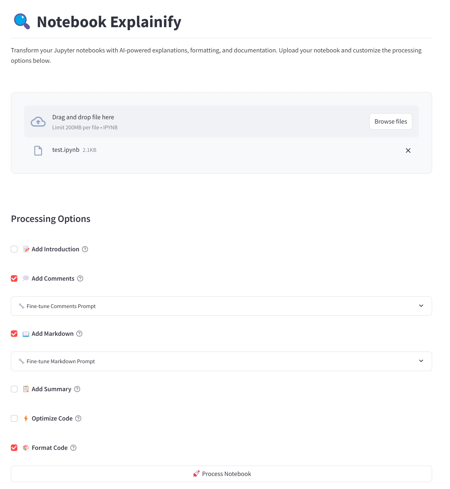

# nb-explainify 

Transform your Jupyter notebooks from plain to extraordinary! nb-explainify is your AI-powered companion that turns basic notebooks into clear documentation that your colleagues will admire and future-you will thank you for.

## Why nb-explainify? 

Ever found yourself:
- Staring at notebooks you created months ago, wondering what it does? 
- Rushing to meet deadlines and skipping proper documentation?
- Wanting to share your notebooks but feeling they need more polish?

Say goodbye to these problems! nb-explainify leverages the power of OpenAI's GPT models to automatically:
- Generate crystal-clear explanations that actually make sense
- Optimize your code while preserving its functionality
- Add professional-grade comments that future readers will appreciate
- Create engaging introductions that set the perfect context
- Provide insightful summaries with practical next steps

Think of it as having a professional technical writer, code reviewer, and documentation expert working for you 24/7!

## Features 

- **Smart Markdown Generation**: Get concise, context-aware explanations that focus on what matters. No more generic comments!
- **AI-Powered Code Optimization**: Uses OpenAI's GPT models to suggest code improvements for better readability and efficiency. While the optimization is generally reliable, we recommend verifying that the optimized code maintains the original functionality, as LLMs may occasionally generate incorrect suggestions.
- **Professional Documentation**: Add clear, detailed comments that explain not just what the code does, but why it does it
- **Engaging Introductions**: Create compelling notebook introductions that perfectly set up your work's context and goals
- **Insightful Summaries**: Generate comprehensive summaries with practical suggestions for future improvements
- **Code Beautification**: Ensure your code follows consistent style guidelines automatically

Best of all? It takes just a few lines of code to transform your notebook from basic to brilliant!

## Example Notebooks 

Want to see nb-explainify in action? Check out our example notebooks:
- [`test.ipynb`](test.ipynb): A basic notebook before enhancement
- [`test_explanified.ipynb`](test_explanified.ipynb): The same notebook after running nb-explainify

Compare these notebooks to see how nb-explainify:
- Adds clear, educational explanations
- Enhances code readability
- Creates a comprehensive introduction and summary
- Maintains the original functionality while improving documentation

## Compatibility Note 

While nb-explainify works with any Jupyter notebook, it performs best with notebooks that have minimal or no existing comments. For notebooks with existing documentation:
- Existing markdown cells will be enhanced rather than replaced
- New explanations will complement existing documentation
- The tool focuses on filling documentation gaps
- Code optimization and beautification work independently of existing comments

## Getting Started 

There are two ways to use nb-explainify:

### 1. Streamlit Web App 

Want to use nb-explainify without writing any code? We've got you covered with our user-friendly Streamlit web app! Simply:

1. Launch the app with `streamlit run app.py`
2. Upload your Jupyter notebook (max 200MB)
3. Customize your processing options:
   - ** Add Introduction**: Generate a comprehensive introduction
   - ** Add Comments**: Add explanatory comments to code cells
   - ** Add Summary**: Create an insightful summary
   - ** Add Markdown**: Generate explanatory markdown cells
   - ** Optimize Code**: Get code optimization suggestions
   - ** Format Code**: Format code using Black



Each option (except Format Code) comes with a fine-tuning feature where you can customize the prompts to match your specific needs.

The app will process your notebook and provide a download link for the enhanced version. It's that simple!

### 2. Python API 

For more programmatic control or batch processing, you can use nb-explainify directly in your Python code:

```python
from nb_explainify import NotebookProcessor, LLMProcessor

# Initialize the processor
processor = NotebookProcessor(llm_processor=LLMProcessor())

# Load and process your notebook
processor.load_notebook("your_notebook.ipynb")
processor.explainify_notebook(
    output_path="enhanced_notebook.ipynb",
    to_format=True,
    to_comment=True,
    to_optimize=True,
    to_markdown=True,
    to_intro=True,
    to_summary=True
)
```

See the [Customizing Prompts](#customizing-prompts-) section below for advanced configuration options.

## Customizing Prompts 

nb-explainify comes with carefully crafted default prompts that work well for most use cases. However, you can customize how it generates explanations, comments, and optimizations by providing your own prompts. You can override any specific prompt while keeping the defaults for others.

Here's how to customize prompts:

```python
from nb_explainify import NotebookProcessor, LLMProcessor

# Define your custom prompts
custom_prompts = {
    # Customize markdown explanations
    'markdown_explanation': """
    Write a detailed explanation focusing on:
    - Mathematical concepts
    - Physical interpretations
    - Key assumptions
    {code} will be replaced with the code to explain
    {context} will be replaced with previous cells
    """,
    
    # Customize code comments
    'code_comments': """
    Add comments that highlight:
    - Performance considerations
    - Error handling
    - Algorithm complexity
    {code} will be replaced with the code to comment
    """,
    
    # Customize code optimization
    'code_optimization': """
    Optimize the code focusing on:
    - Memory efficiency
    - Vectorization
    - Parallel processing
    {code} will be replaced with the code to optimize
    {context} will be replaced with previous cells
    """
}

# Initialize with custom prompts - other prompts will use defaults
processor = NotebookProcessor(llm_processor=LLMProcessor(prompts=custom_prompts))
processor.load_notebook("your_notebook.ipynb")
processor.explainify_notebook(output_path="enhanced_notebook.ipynb")
```

Available prompt keys (all have sensible defaults):
- `notebook_summary`: Customize how notebook summaries are generated
- `notebook_intro`: Customize how introductions are written
- `code_optimization`: Customize the code optimization focus
- `code_comments`: Customize the style of code comments
- `markdown_explanation`: Customize how code is explained
- `enhance_markdown`: Customize how existing markdown is enhanced

Each prompt should include placeholders (e.g., `{code}`, `{context}`) that will be replaced with actual content during processing. You can view the default prompts in the `DefaultPrompts` class in `llm_processor.py` to understand how they work before customizing.

## Installation

1. Clone the repository:
```bash
git clone https://github.com/fyc2646/nb-explainify.git
cd nb-explainify
```

2. Install dependencies:
```bash
pip install -e .
```

3. Set up your OpenAI API key in a `.env` file:
```bash
OPENAI_API_KEY=your_api_key_here
```

4. Launch the Streamlit app:
# nb-explainify 🚀

Transform your Jupyter notebooks from plain to extraordinary! nb-explainify is your AI-powered companion that turns basic notebooks into clear documentation that your colleagues will admire and future-you will thank you for.

## Why nb-explainify? ✨

Ever found yourself:
- Staring at notebooks you created months ago, wondering what it does? 
- Rushing to meet deadlines and skipping proper documentation?
- Wanting to share your notebooks but feeling they need more polish?

Say goodbye to these problems! nb-explainify leverages the power of OpenAI's GPT models to automatically:
- Generate crystal-clear explanations that actually make sense
- Optimize your code while preserving its functionality
- Add professional-grade comments that future readers will appreciate
- Create engaging introductions that set the perfect context
- Provide insightful summaries with practical next steps

Think of it as having a professional technical writer, code reviewer, and documentation expert working for you 24/7!

## Features 🎯

- **Smart Markdown Generation**: Get concise, context-aware explanations that focus on what matters. No more generic comments!
- **AI-Powered Code Optimization**: Uses OpenAI's GPT models to suggest code improvements for better readability and efficiency. While the optimization is generally reliable, we recommend verifying that the optimized code maintains the original functionality, as LLMs may occasionally generate incorrect suggestions.
- **Professional Documentation**: Add clear, detailed comments that explain not just what the code does, but why it does it
- **Engaging Introductions**: Create compelling notebook introductions that perfectly set up your work's context and goals
- **Insightful Summaries**: Generate comprehensive summaries with practical suggestions for future improvements
- **Code Beautification**: Ensure your code follows consistent style guidelines automatically

Best of all? It takes just a few lines of code to transform your notebook from basic to brilliant!

## Example Notebooks 📚

Want to see nb-explainify in action? Check out our example notebooks:
- [`test.ipynb`](test.ipynb): A basic notebook before enhancement
- [`test_explanified.ipynb`](test_explanified.ipynb): The same notebook after running nb-explainify

Compare these notebooks to see how nb-explainify:
- Adds clear, educational explanations
- Enhances code readability
- Creates a comprehensive introduction and summary
- Maintains the original functionality while improving documentation

## Compatibility Note 📝

While nb-explainify works with any Jupyter notebook, it performs best with notebooks that have minimal or no existing comments. For notebooks with existing documentation:
- Existing markdown cells will be enhanced rather than replaced
- New explanations will complement existing documentation
- The tool focuses on filling documentation gaps
- Code optimization and beautification work independently of existing comments

## Getting Started 🚀

There are two ways to use nb-explainify:

### 1. Streamlit Web App 🌐

Want to use nb-explainify without writing any code? We've got you covered with our user-friendly Streamlit web app! Simply:

1. Launch the app with `streamlit run app.py`
2. Upload your Jupyter notebook (max 200MB)
3. Customize your processing options:
   - **📝 Add Introduction**: Generate a comprehensive introduction
   - **💭 Add Comments**: Add explanatory comments to code cells
   - **📋 Add Summary**: Create an insightful summary
   - **📖 Add Markdown**: Generate explanatory markdown cells
   - **⚡ Optimize Code**: Get code optimization suggestions
   - **🎨 Format Code**: Format code using Black


Each option (except Format Code) comes with a fine-tuning feature where you can customize the prompts to match your specific needs.

The app will process your notebook and provide a download link for the enhanced version. It's that simple!

### 2. Python API 🐍

For more programmatic control or batch processing, you can use nb-explainify directly in your Python code:

```python
from nb_explainify import NotebookProcessor, LLMProcessor

# Initialize the processor
processor = NotebookProcessor(llm_processor=LLMProcessor())

# Load and process your notebook
processor.load_notebook("your_notebook.ipynb")
processor.explainify_notebook(
    output_path="enhanced_notebook.ipynb",
    to_format=True,
    to_comment=True,
    to_optimize=True,
    to_markdown=True,
    to_intro=True,
    to_summary=True
)
```

See the [Customizing Prompts](#customizing-prompts-) section below for advanced configuration options.

## Customizing Prompts 🎨

nb-explainify comes with carefully crafted default prompts that work well for most use cases. However, you can customize how it generates explanations, comments, and optimizations by providing your own prompts. You can override any specific prompt while keeping the defaults for others.

Here's how to customize prompts:

```python
from nb_explainify import NotebookProcessor, LLMProcessor

# Define your custom prompts
custom_prompts = {
    # Customize markdown explanations
    'markdown_explanation': """
    Write a detailed explanation focusing on:
    - Mathematical concepts
    - Physical interpretations
    - Key assumptions
    {code} will be replaced with the code to explain
    {context} will be replaced with previous cells
    """,
    
    # Customize code comments
    'code_comments': """
    Add comments that highlight:
    - Performance considerations
    - Error handling
    - Algorithm complexity
    {code} will be replaced with the code to comment
    """,
    
    # Customize code optimization
    'code_optimization': """
    Optimize the code focusing on:
    - Memory efficiency
    - Vectorization
    - Parallel processing
    {code} will be replaced with the code to optimize
    {context} will be replaced with previous cells
    """
}

# Initialize with custom prompts - other prompts will use defaults
processor = NotebookProcessor(llm_processor=LLMProcessor(prompts=custom_prompts))
processor.load_notebook("your_notebook.ipynb")
processor.explainify_notebook(output_path="enhanced_notebook.ipynb")
```

Available prompt keys (all have sensible defaults):
- `notebook_summary`: Customize how notebook summaries are generated
- `notebook_intro`: Customize how introductions are written
- `code_optimization`: Customize the code optimization focus
- `code_comments`: Customize the style of code comments
- `markdown_explanation`: Customize how code is explained
- `enhance_markdown`: Customize how existing markdown is enhanced

Each prompt should include placeholders (e.g., `{code}`, `{context}`) that will be replaced with actual content during processing. You can view the default prompts in the `DefaultPrompts` class in `llm_processor.py` to understand how they work before customizing.

## Installation

1. Clone the repository:
```bash
git clone https://github.com/fyc2646/nb-explainify.git
cd nb-explainify
```

2. Install dependencies:
```bash
pip install -r requirements.txt
```

3. Set up your OpenAI API key in a `.env` file:
```bash
OPENAI_API_KEY=your_api_key_here
```

## Usage

Basic usage:
```python
from nb_explainify import NotebookProcessor

# Load and process a notebook
processor = NotebookProcessor()
processor.load_notebook("your_notebook.ipynb")
processor.explainify_notebook(output_path="enhanced_notebook.ipynb")
```

Customize processing options:
```python
processor.explainify_notebook(
    output_path="custom_notebook.ipynb",
    to_format=True,      # Format code cells
    to_comment=True,     # Add code comments
    to_optimize=True,    # Optimize code
    to_markdown=True,    # Add markdown explanations
    to_intro=True,       # Add introduction
    to_summary=True      # Add summary
)
```

## License

This project is licensed under the MIT License - see the LICENSE file for details.